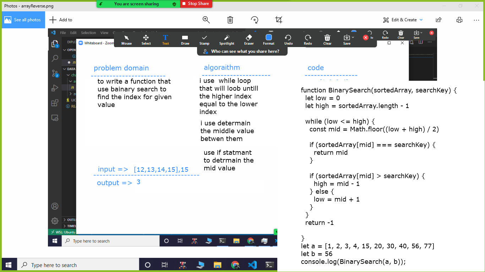

# BinarySearch an Array
we need to write  function that takes an array and a key value and return the index of the key value if it existed and return -1 if not existed

## Challenge
Write a function called using the idea of Binary search
## Approach & Efficiency
its forbidden to use a bulid in method for unknown reasons so 
i watch a vedio on youtube and i understand the Binary search search from it then i copy the answer 

## Solution

