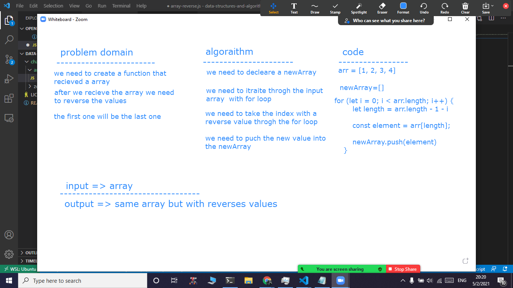

# Reverse an Array
we need to write  function that takes an array of items and return same array but reversed 

## Challenge
Write a function called reverseArray which takes an array as an argument. Without utilizing any of the built-in methods available to your language, return an array with elements in reversed order.

## Approach & Efficiency
its forbidden to use a bulid in method for unknown reasons so i think of using a for loop and i declare a variable called length that equal to the array.length -1 then i subtract  (i) every iterate  to give me the index in reverse  then i   a sign  a value    in to variable using object notation bracket then i puch it into newArray

## Solution

