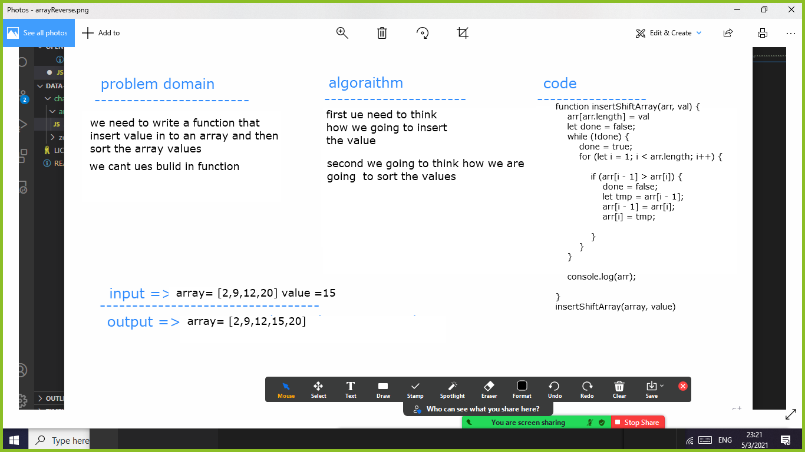

# ArrayShift
we need to write  function that takes an array and value and insert the value into an array after that we going to sort the array 

## Challenge
Write a function called insertShiftArray which takes an array and value as an arguments. Without utilizing any of the built-in methods available to your language, return an array with elements in reversed order.
hhhhhhhhhhhhhhhhhh i cry

## Approach & Efficiency
its forbidden to use a bulid in method for unknown reasons so i think of using a object notation bracket to add a value in to array at index = to array length  and then i copy a function that will sort the item from google 
## Solution

