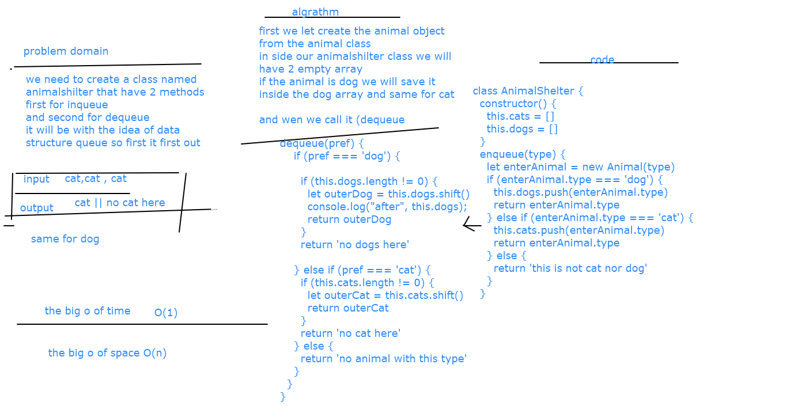

# fifo-animal-shelter
we need to write  class name fifo-animal-shelter  that have 2 methods  enqueue and dequeue 
## Challenge
we will make this class with the queue data structure so the first in the first out 
## Approach & Efficiency
i create 2 arrays inside the class one for dog and the other for cats and we insert and discard from these arrays 

## Solution

