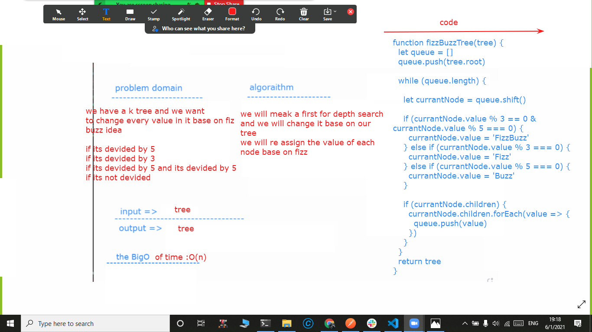

# fizzBuzzTree
we need to write  class for node and tree and a  function that take atree
## Challenge
no challenge
## Approach & Efficiency
i will re edit a lyerby layer search to sole it see pic

## Solution

