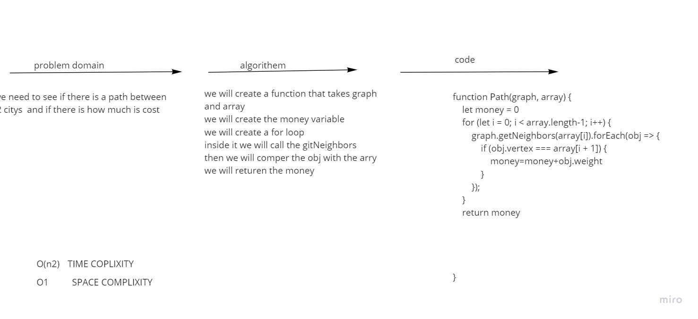

# Challenge Summary
we need to see if there is a path between 2 citys  and if there is how much is cost  

## Whiteboard Process

## Approach & Efficiency
we will create a function that takes graph
and array
we will create the money variable
we will create a for loop
inside it we will call the gitNeighbors
then we will comper the obj with the arry
we will returen the money

## Solution
i test in inside the test file 