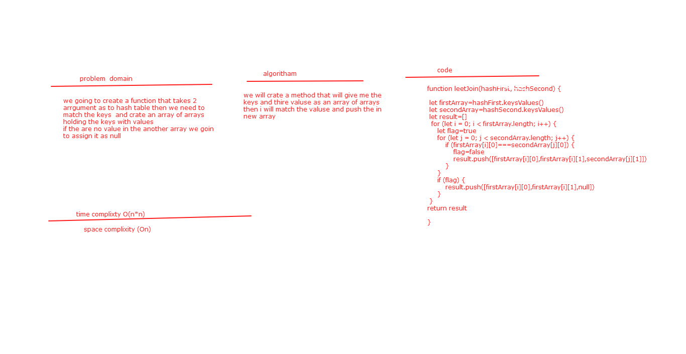

# Hashmap LEFT JOIN
we going to create a function that takes 2 arrgument as to hash table then we need to match the keys  and crate an array of arrays holding the keys with values 
if the are no value in the another array we goin to assign it as null

## Challenge
working with the hash table

## Approach & Efficiency
we will crate a method that will give me the keys and thire valuse as an array of arrays
then i will match the valuse and push the in new array 

## Solution
