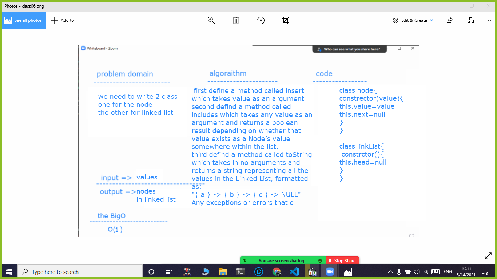

# linked list
we need to write 2 class one for the node and one for the link list

## Challenge
i face some challenge when i implement the toString() method i revise the reduse method in order io solve it 

## Approach & Efficiency
...
## Solution

