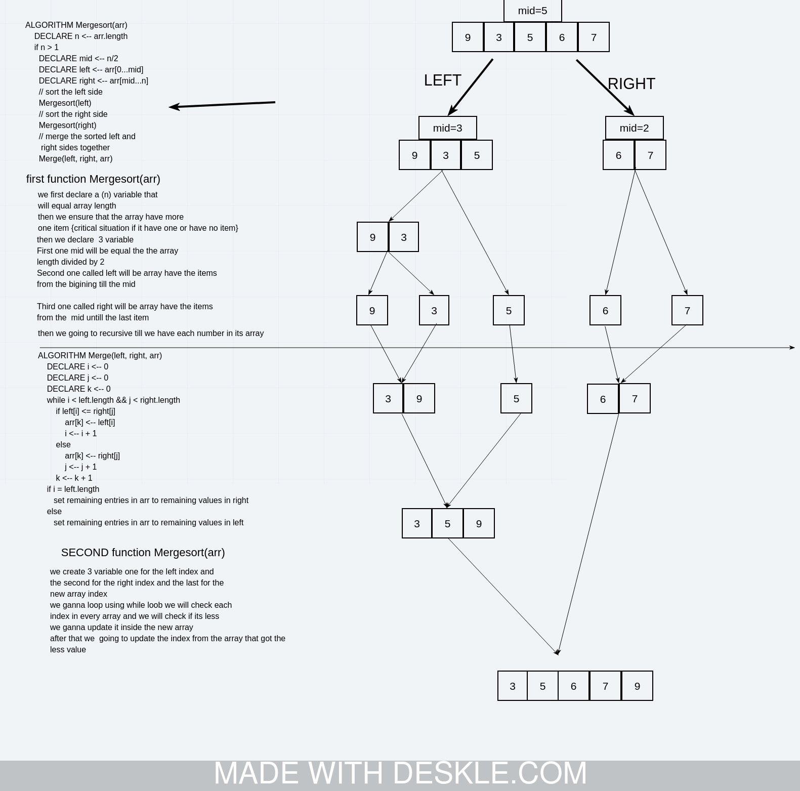

# Merge Sort based on the pseudocode provided.
we need to sort an array using merge array and we need to explane how that happen in the pseudocode

## Challenge
understanding the code and the recarsve things

## Approach & Efficiency
rewrite it with the javescript
## Solution

