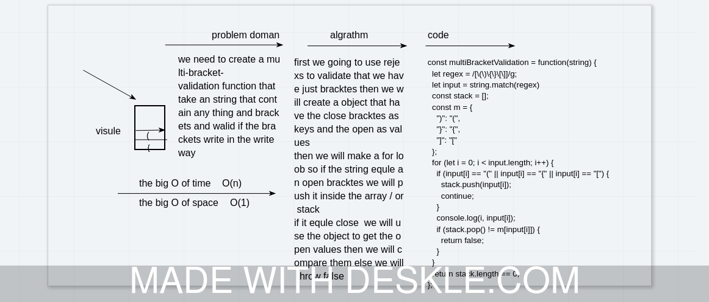

# multi-bracket-validation
we need to create a multi-bracket-validation function that take an string that contain any thing and brackets and walid if the brackets write in the write way  
## Challenge
the challenge here is the idea of giving  the  code the idea when ever the bracktes opens they needed to be closed in the same order 
## Approach & Efficiency
first we going to use rejexs to validate that we have just bracktes then we will create a object that have the close bracktes as keys and the open as values 
then we will make a for loob so if the string equle an open bracktes we will push it inside the array / or stack 
if it equle close  we will use the object to get the open values then we will compare them else we will throw false   

## Solution

