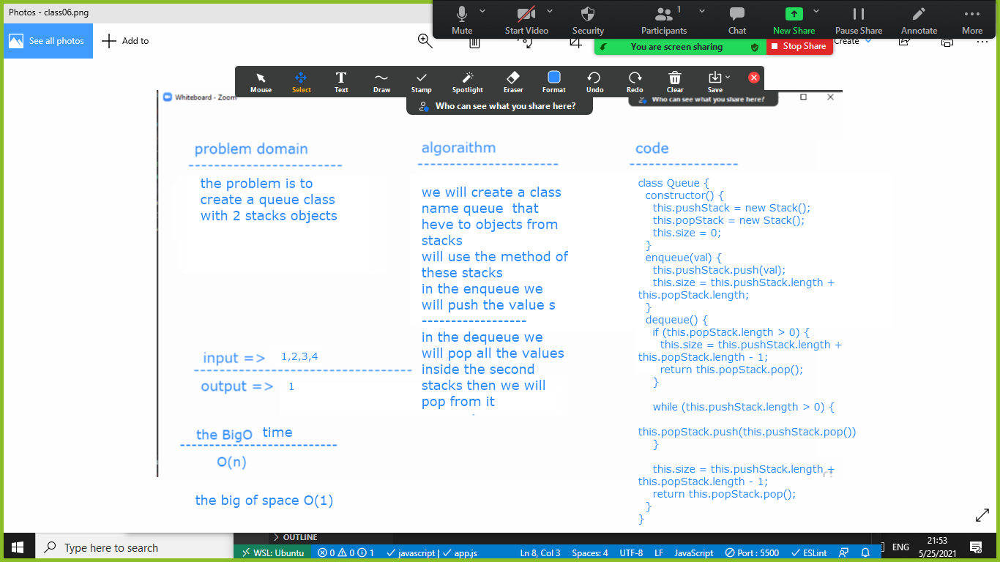

# Queue With Stacks
we need to create a queue method using t stacks of object 
## Challenge
the challenge here is the idea of reverse the code challenge 
## Approach & Efficiency
to create t stack  the work will be inside the dequeue so when we dequeue we will dequeue inside the  other stack and we will pop from the other stack 

## Solution

