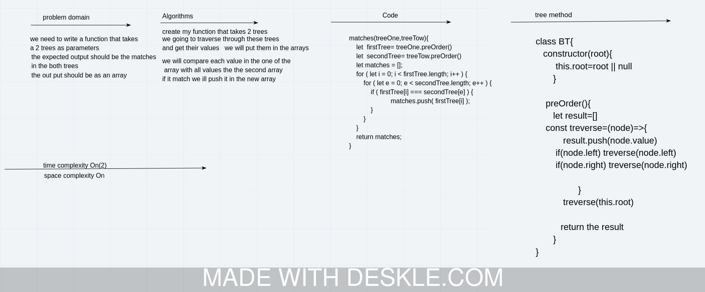

# trees
​we need to write a function that takes a 2 trees as parameters 
## Challenge
​the expected output should be the matches  in the both trees 
## Approach & Efficiency
​we going to traverse through these trees and get their values  we will put them in the arrays
​we will compare each value in the one of the  array with all values the the second array if it match we ill push it in the new array 

 

## Solution

