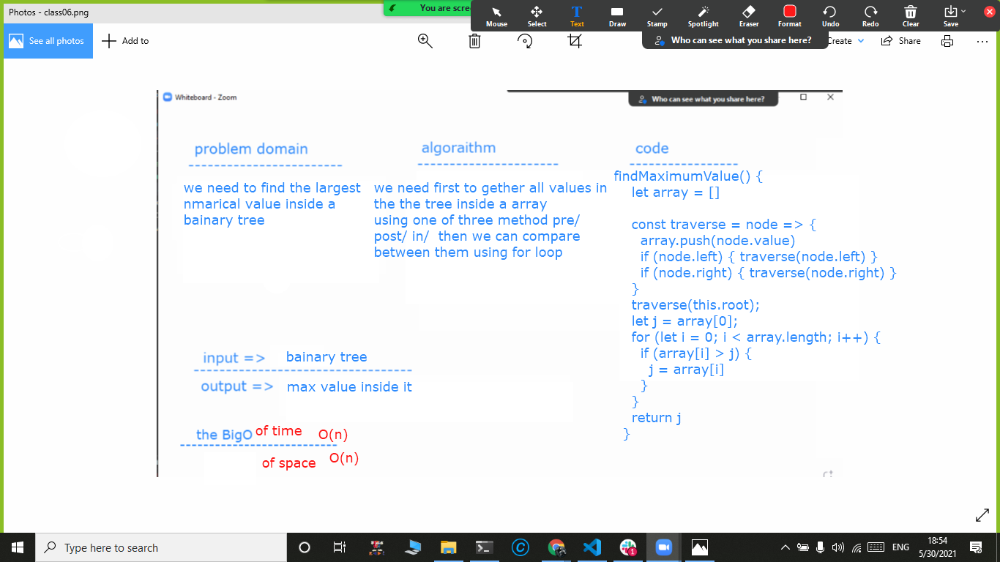

# trees
creating find max value inside a binary tree
## Challenge
the challenge here is the idea of of using recursive  function to geather all values from the tree
## Approach & Efficiency
we need first to gether all values in the the tree inside a array 
using one of three method pre/ post/ in/  then we can compare between them using for loop

## Solution

